# NepseGo Database Documentation

> ✅ **Verified against live database on 2026-02-22**
> 
> **Database**: `nepsego` | **Engine**: InnoDB (MariaDB/MySQL) | **Charset**: utf8mb4 / utf8mb4_unicode_ci
> **Total Tables**: 20 (excluding `brokers`)

---

## High-Level Overview

The `nepsego` database collects and stores data from the **Nepal Stock Exchange (NEPSE)**. It supports a Python-based backend scraping system that periodically fetches market data from NEPSE's APIs. The database captures:

- **Market-wide data**: Daily indices, sub-indices, market summaries, and trading schedules
- **Security-level data**: Company details, fundamentals, OHLCV candles, intraday price graphs, and live snapshots
- **Trading activity**: Floorsheet transactions, top movers, scrip rankings, and trade/turnover/transaction sub-indices
- **Corporate events**: Dividends and corporate actions (bonus shares, rights issues, etc.)
- **Operations**: Collection run logs, system diagnostics

```mermaid
erDiagram
    securities ||--o{ company_details : "security_id"
    securities ||--o{ company_fundamentals : "symbol"
    securities ||--o{ corporate_actions : "symbol"
    securities ||--o{ daily_ohlcv : "symbol"
    securities ||--o{ daily_script_price_graph : "symbol"
    securities ||--o{ dividends : "symbol"
    securities ||--o{ floorsheet_transactions : "security_id / symbol"
    securities ||--o{ live_market_snapshots : "security_id / symbol"
    securities ||--o{ scrip_rankings : "security_id / symbol"
    securities ||--o{ top_movers : "security_id / symbol"
    securities ||--o{ daily_prices : "security_id / symbol"
    securities ||--o{ daily_trade_turnover_transaction_subindices : "symbol"
    market_schedule ||--o{ market_summary : "trading_date"
    market_schedule ||--o{ daily_ohlcv : "trading_date"
    market_schedule ||--o{ floorsheet_transactions : "trading_date"
```

---

## Table of Contents

| # | Table | Rows (Live) | Purpose |
| --- | --- | ---: | --- |
| 1 | [collection_runs](#1-collection-runs) | 513 | Tracks each data collection job executed by the scraping system, including type, status, record counts, and errors |
| 2 | [company_details](#2-company-details) | 384 | Master table containing detailed static and semi-static information about listed companies |
| 3 | [company_fundamentals](#3-company-fundamentals) | 3,327 | Quarterly and annual fundamental financial data for listed companies |
| 4 | [corporate_actions](#4-corporate-actions) | 864 | Records corporate actions like bonus share issues, rights issues, and cash dividends |
| 5 | [daily_index_graph](#5-daily-index-graph) | 3,683 | Intraday tick-level data for NEPSE and all sub-indices |
| 6 | [daily_ohlcv](#6-daily-ohlcv) | 91,700 | Daily Open-High-Low-Close-Volume candlestick data for each security |
| 7 | [daily_script_price_graph](#7-daily-script-price-graph) | 22,463 | Intraday price ticks for individual securities (scrip-level graph data) |
| 8 | [daily_trade_turnover_transaction_subindices](#8-daily-trade-turnover-transaction-subindices) | 256 | Daily sector-wise breakdown of trade, turnover, and transaction data for all listed securities |
| 9 | [dividends](#9-dividends) | 640 | Historical dividend declarations including bonus share and cash dividend information |
| 10 | [floorsheet_transactions](#10-floorsheet-transactions) | 83,075 | Detailed individual trade records from the NEPSE floorsheet |
| 11 | [live_market_snapshots](#11-live-market-snapshots) | 64,799 | Point-in-time snapshots of live market data for each security during trading hours |
| 12 | [market_indices](#12-market-indices) | 36 | Daily closing values for market-wide indices (NEPSE, Sensitive, Float, etc |
| 13 | [market_schedule](#13-market-schedule) | 10 | Trading calendar tracking trading days, holidays, and market hours |
| 14 | [market_summary](#14-market-summary) | 1 | Daily aggregate market statistics including turnover, traded shares, and market capitalization |
| 15 | [nepse_sub_indices](#15-nepse-sub-indices) | 13 | Current values and changes for NEPSE sector sub-indices |
| 16 | [scrip_rankings](#16-scrip-rankings) | 1,062 | Daily ranked lists of top securities by shares traded, turnover value, and transaction count |
| 17 | [securities](#17-securities) | 753 | Master list of all securities listed on NEPSE |
| 18 | [system_logs](#18-system-logs) | 808 | Application-level log entries for monitoring and diagnostics |
| 19 | [top_movers](#19-top-movers) | 337 | Daily list of top gaining and losing securities |
| 20 | [daily_prices](#20-daily-prices) | 1,632 | End-of-day price summary per security with OHLC, volume, turnover, and percent change |

> **Total rows across all tables**: 276,356

---

## 1. `collection_runs`

Tracks each data collection job executed by the scraping system, including type, status, record counts, and errors.

**Row Count**: 513

### Schema

| Column | Type | Nullable | Default | Description |
| --- | --- | --- | --- | --- |
| `id` | bigint(20) | NO | AUTO_INCREMENT | — |
| `trading_date` | date | NO | — | — |
| `run_timestamp` | datetime | NO | `current_timestamp()` | — |
| `collection_type` | enum('floorsheet','live_market','daily_summary','brokers','securities') | NO | — | — |
| `records_collected` | int(11) | YES | `0` | — |
| `records_inserted` | int(11) | YES | `0` | — |
| `records_updated` | int(11) | YES | `0` | — |
| `records_failed` | int(11) | YES | `0` | — |
| `status` | enum('started','completed','failed','partial') | NO | — | — |
| `error_message` | text | YES | NULL | — |
| `duration_seconds` | decimal(10,2) | YES | NULL | — |
| `created_at` | timestamp | NO | `current_timestamp()` | — |

### Indexes

| Name | Type | Columns |
| --- | --- | --- |
| `PRIMARY` | Primary Key | `id` |
| `idx_trading_date` | Index | `trading_date` |
| `idx_collection_type` | Index | `collection_type` |
| `idx_status` | Index | `status` |

### Sample Data (LIMIT 5)

> *Showing 8 of 12 columns*

| id | trading_date | run_timestamp | collection_type | records_collected | records_inserted | records_updated | records_failed |
| --- | --- | --- | --- | --- | --- | --- | --- |
| 1 | 2026-02-03 | 2026-02-03 12:32:22 | securities | 540 | 540 | 0 | 0 |
| 2 | 2026-02-03 | 2026-02-03 12:32:29 | brokers | 0 | 0 | 0 | 0 |
| 3 | 2026-02-03 | 2026-02-03 12:32:31 | floorsheet | 0 | 0 | 0 | 0 |
| 4 | 2026-02-03 | 2026-02-03 12:32:36 | live_market | 304 | 304 | 0 | 0 |
| 5 | 2026-02-03 | 2026-02-03 12:42:36 | floorsheet | 0 | 0 | 0 | 0 |

---

## 2. `company_details`

Master table containing detailed static and semi-static information about listed companies.

**Row Count**: 384

### Schema

| Column | Type | Nullable | Default | Description |
| --- | --- | --- | --- | --- |
| `security_id` | int(11) | NO | — | — |
| `symbol` | varchar(20) | NO | — | — |
| `security_name` | varchar(255) | YES | NULL | — |
| `company_name` | varchar(255) | YES | NULL | — |
| `sector_name` | varchar(100) | YES | NULL | — |
| `regulatory_body` | varchar(100) | YES | NULL | — |
| `isin` | varchar(50) | YES | NULL | — |
| `instrument_type` | varchar(50) | YES | NULL | — |
| `face_value` | decimal(10,2) | YES | NULL | — |
| `tick_size` | decimal(6,4) | YES | NULL | — |
| `credit_rating` | varchar(50) | YES | NULL | — |
| `share_group` | varchar(10) | YES | NULL | — |
| `is_promoter` | char(1) | YES | NULL | — |
| `listing_date` | date | YES | NULL | — |
| `capital_gain_base_date` | date | YES | NULL | — |
| `trading_start_date` | date | YES | NULL | — |
| `permitted_to_trade` | char(1) | YES | NULL | — |
| `status` | char(1) | YES | NULL | — |
| `stock_listed_shares` | bigint(20) | YES | NULL | — |
| `paid_up_capital` | decimal(25,2) | YES | NULL | — |
| `issued_capital` | decimal(25,2) | YES | NULL | — |
| `market_capitalization` | decimal(25,2) | YES | NULL | — |
| `public_shares` | decimal(20,2) | YES | NULL | — |
| `public_percentage` | decimal(10,2) | YES | NULL | — |
| `promoter_shares` | decimal(20,2) | YES | NULL | — |
| `promoter_percentage` | decimal(10,2) | YES | NULL | — |
| `fifty_two_week_high` | decimal(10,2) | YES | NULL | — |
| `fifty_two_week_low` | decimal(10,2) | YES | NULL | — |
| `email` | varchar(255) | YES | NULL | — |
| `website` | varchar(255) | YES | NULL | — |
| `contact_person` | varchar(255) | YES | NULL | — |
| `company_registration_number` | varchar(50) | YES | NULL | — |
| `last_updated_time` | datetime | YES | NULL | — |
| `company_updated_date` | datetime | YES | NULL | — |
| `created_at` | timestamp | NO | `current_timestamp()` | — |

### Indexes

| Name | Type | Columns |
| --- | --- | --- |
| `PRIMARY` | Primary Key | `security_id` |

### Sample Data (LIMIT 5)

> *Showing 8 of 35 columns*

| security_id | symbol | security_name | company_name | sector_name | regulatory_body | isin | instrument_type |
| --- | --- | --- | --- | --- | --- | --- | --- |
| 131 | NABIL | Nabil Bank Limited | Nabil Bank Limited | Commercial Banks | Nepal Rastra Bank | NPE025A00004 | Equity |
| 132 | NIMB | Nepal Investment Mega Bank Limited | Nepal Investment Mega Bank Limited | Commercial Banks | Nepal Rastra Bank | NPE028A00008 | Equity |
| 133 | SCB | Standard Chartered Bank Limited | Standard Chartered Bank  Nepal Limited | Commercial Banks | Nepal Rastra Bank | NPE033A00008 | Equity |
| 134 | HBL | Himalayan Bank Limited | Himalayan Bank Limited | Commercial Banks | Nepal Rastra Bank | NPE019A00007 | Equity |
| 135 | SBI | Nepal SBI Bank Limited | Nepal SBI Bank Limited | Commercial Banks | Nepal Rastra Bank | NPE007A00002 | Equity |

---

## 3. `company_fundamentals`

Quarterly and annual fundamental financial data for listed companies.

**Row Count**: 3,327

### Schema

| Column | Type | Nullable | Default | Description |
| --- | --- | --- | --- | --- |
| `id` | bigint(20) | NO | AUTO_INCREMENT | — |
| `symbol` | varchar(20) | NO | — | — |
| `fiscal_year` | varchar(20) | NO | — | — |
| `quarter` | varchar(10) | NO | — | — |
| `eps` | decimal(10,2) | YES | NULL | — |
| `book_value` | decimal(10,2) | YES | NULL | — |
| `pe_ratio` | decimal(10,2) | YES | NULL | — |
| `net_profit` | decimal(20,2) | YES | NULL | — |
| `published_date` | date | YES | NULL | — |
| `created_at` | timestamp | NO | `current_timestamp()` | — |

### Indexes

| Name | Type | Columns |
| --- | --- | --- |
| `PRIMARY` | Primary Key | `id` |
| `uniq_report` | Unique Key | `symbol`, `fiscal_year`, `quarter` |
| `idx_valuation` | Index | `symbol`, `pe_ratio` |

### Sample Data (LIMIT 5)

> *Showing 8 of 10 columns*

| id | symbol | fiscal_year | quarter | eps | book_value | pe_ratio | net_profit |
| --- | --- | --- | --- | --- | --- | --- | --- |
| 1 | NABIL | 2025-2026 | Second Qua | 35.04 | 235.64 | 13.91 | 4759641000.00 |
| 2 | NABIL | 2025-2026 | First Quar | 25.49 | 240.72 | 19.97 | 1756991000.00 |
| 3 | NABIL | 2024-2025 | Fourth Qua | 26.34 | 235.58 | 20.55 | 7127566000.00 |
| 4 | NABIL | 2024-2025 | Third Quar | 25.05 | 226.36 | 19.44 | 5051419000.00 |
| 5 | NABIL | 2024-2025 | Second Qua | 24.05 | 219.01 | 20.36 | 3244277000.00 |

---

## 4. `corporate_actions`

Records corporate actions like bonus share issues, rights issues, and cash dividends.

**Row Count**: 864

### Schema

| Column | Type | Nullable | Default | Description |
| --- | --- | --- | --- | --- |
| `id` | int(11) | NO | AUTO_INCREMENT | — |
| `symbol` | varchar(20) | NO | — | — |
| `action_type` | varchar(100) | YES | NULL | — |
| `quantity` | varchar(50) | YES | NULL | — |
| `ratio` | varchar(20) | YES | NULL | — |
| `notify_date` | date | YES | NULL | — |
| `book_close_date` | date | YES | NULL | — |
| `created_at` | timestamp | NO | `current_timestamp()` | — |

### Indexes

| Name | Type | Columns |
| --- | --- | --- |
| `PRIMARY` | Primary Key | `id` |
| `uniq_action` | Unique Key | `symbol`, `action_type`, `notify_date` |

### Sample Data (LIMIT 5)

| id | symbol | action_type | quantity | ratio | notify_date | book_close_date | created_at |
| --- | --- | --- | --- | --- | --- | --- | --- |
| 1 | NABIL | Bonus Share |  | 18.50% | 2023-01-01 | 2023-01-01 | 2026-02-03 23:40:51 |
| 2 | NABIL | Bonus Share |  | 33.60% | 2021-12-31 | 2021-12-31 | 2026-02-03 23:40:51 |
| 3 | NABIL | Bonus Share |  | 33.50% | 2020-12-29 | 2020-12-29 | 2026-02-03 23:40:51 |
| 4 | NABIL | Bonus Share |  | 12.00% | 2019-12-23 | 2019-12-23 | 2026-02-03 23:40:51 |
| 5 | NABIL | Bonus Share |  | 12.00% | 2019-02-25 | 2019-02-25 | 2026-02-03 23:40:51 |

---

## 5. `daily_index_graph`

Intraday tick-level data for NEPSE and all sub-indices.

**Row Count**: 3,683

### Schema

| Column | Type | Nullable | Default | Description |
| --- | --- | --- | --- | --- |
| `id` | bigint(20) | NO | AUTO_INCREMENT | — |
| `index_id` | smallint(5) unsigned | NO | — | Numeric ID used in API URL |
| `index_name` | varchar(100) | NO | — | Human-readable index name |
| `unix_time` | bigint(20) | NO | — | Unix timestamp (seconds) from API array[0] |
| `index_value` | decimal(12,4) | NO | — | Index level from API array[1] |
| `trading_date` | date | NO | — | Derived from unix_time for partitioning/filtering |
| `created_at` | timestamp | NO | `current_timestamp()` | — |

### Indexes

| Name | Type | Columns |
| --- | --- | --- |
| `PRIMARY` | Primary Key | `id` |
| `uniq_index_tick` | Unique Key | `index_id`, `unix_time` |
| `idx_dig_name_date` | Index | `index_name`, `trading_date` |
| `idx_dig_trading_date` | Index | `trading_date` |

### Sample Data (LIMIT 5)

| id | index_id | index_name | unix_time | index_value | trading_date | created_at |
| --- | --- | --- | --- | --- | --- | --- |
| 1 | 1 | nepse_index | 1771304700 | 2663.5800 | 2026-02-17 | 2026-02-21 23:37:36 |
| 2 | 1 | nepse_index | 1771305300 | 2663.7100 | 2026-02-17 | 2026-02-21 23:37:36 |
| 3 | 1 | nepse_index | 1771305360 | 2665.8200 | 2026-02-17 | 2026-02-21 23:37:36 |
| 4 | 1 | nepse_index | 1771305420 | 2664.7100 | 2026-02-17 | 2026-02-21 23:37:36 |
| 5 | 1 | nepse_index | 1771305480 | 2664.3300 | 2026-02-17 | 2026-02-21 23:37:36 |

---

## 6. `daily_ohlcv`

Daily Open-High-Low-Close-Volume candlestick data for each security. This is the **largest table** by record count.

**Row Count**: 91,700

### Schema

| Column | Type | Nullable | Default | Description |
| --- | --- | --- | --- | --- |
| `id` | bigint(20) | NO | AUTO_INCREMENT | — |
| `symbol` | varchar(20) | NO | — | — |
| `trading_date` | date | NO | — | — |
| `open_price` | decimal(10,2) | YES | NULL | — |
| `high_price` | decimal(10,2) | YES | NULL | — |
| `low_price` | decimal(10,2) | YES | NULL | — |
| `close_price` | decimal(10,2) | YES | NULL | — |
| `volume` | bigint(20) | YES | NULL | — |
| `turnover` | decimal(20,2) | YES | NULL | — |
| `transaction_count` | int(11) | YES | NULL | — |
| `status` | varchar(20) | YES | `Active` | — |
| `created_at` | timestamp | NO | `current_timestamp()` | — |

### Indexes

| Name | Type | Columns |
| --- | --- | --- |
| `PRIMARY` | Primary Key | `id` |
| `uniq_daily_candle` | Unique Key | `symbol`, `trading_date` |
| `idx_symbol_date` | Index | `symbol`, `trading_date` |

### Sample Data (LIMIT 5)

> *Showing 8 of 12 columns*

| id | symbol | trading_date | open_price | high_price | low_price | close_price | volume |
| --- | --- | --- | --- | --- | --- | --- | --- |
| 1 | NABIL | 2026-02-02 | 0.00 | 500.00 | 488.20 | 498.80 | 61083 |
| 2 | NABIL | 2026-02-01 | 0.00 | 506.00 | 497.00 | 498.10 | 84076 |
| 3 | NABIL | 2026-01-29 | 0.00 | 508.00 | 493.00 | 497.00 | 132087 |
| 4 | NABIL | 2026-01-28 | 0.00 | 495.00 | 490.10 | 492.00 | 48841 |
| 5 | NABIL | 2026-01-27 | 0.00 | 500.00 | 492.10 | 494.90 | 72291 |

---

## 7. `daily_script_price_graph`

Intraday price ticks for individual securities (scrip-level graph data).

**Row Count**: 22,463

### Schema

| Column | Type | Nullable | Default | Description |
| --- | --- | --- | --- | --- |
| `id` | bigint(20) | NO | AUTO_INCREMENT | — |
| `symbol` | varchar(50) | NO | — | — |
| `contract_quantity` | int(11) | YES | NULL | — |
| `contract_rate` | decimal(10,2) | NO | — | — |
| `unix_time` | bigint(20) | NO | — | — |
| `created_at` | timestamp | NO | `current_timestamp()` | — |

### Indexes

| Name | Type | Columns |
| --- | --- | --- |
| `PRIMARY` | Primary Key | `id` |
| `unique_price_point` | Unique Key | `symbol`, `unix_time` |

### Sample Data (LIMIT 5)

| id | symbol | contract_quantity | contract_rate | unix_time | created_at |
| --- | --- | --- | --- | --- | --- |
| 1 | NABIL | NULL | 495.00 | 1771305360 | 2026-02-17 16:00:00 |
| 2 | NABIL | NULL | 495.20 | 1771305780 | 2026-02-17 16:00:00 |
| 3 | NABIL | NULL | 498.40 | 1771306140 | 2026-02-17 16:00:00 |
| 4 | NABIL | NULL | 497.90 | 1771306260 | 2026-02-17 16:00:00 |
| 5 | NABIL | NULL | 498.50 | 1771306320 | 2026-02-17 16:00:00 |

---

## 8. `daily_trade_turnover_transaction_subindices`

Daily sector-wise breakdown of trade, turnover, and transaction data for all listed securities.

**Row Count**: 256

### Schema

| Column | Type | Nullable | Default | Description |
| --- | --- | --- | --- | --- |
| `id` | bigint(20) | NO | AUTO_INCREMENT | — |
| `symbol` | varchar(20) | NO | — | — |
| `sector` | varchar(100) | YES | NULL | — |
| `name` | varchar(255) | YES | NULL | — |
| `category` | varchar(50) | YES | NULL | — |
| `turnover` | decimal(20,2) | YES | NULL | — |
| `transaction_count` | int(11) | YES | NULL | — |
| `volume` | int(11) | YES | NULL | — |
| `ltp` | decimal(10,2) | YES | NULL | — |
| `previous_close` | decimal(10,2) | YES | NULL | — |
| `point_change` | decimal(10,2) | YES | NULL | — |
| `percent_change` | decimal(10,2) | YES | NULL | — |
| `last_updated_time` | bigint(20) | YES | NULL | — |
| `created_at` | timestamp | NO | `current_timestamp()` | — |

### Indexes

| Name | Type | Columns |
| --- | --- | --- |
| `PRIMARY` | Primary Key | `id` |

### Sample Data (LIMIT 5)

> *Showing 8 of 14 columns*

| id | symbol | sector | name | category | turnover | transaction_count | volume |
| --- | --- | --- | --- | --- | --- | --- | --- |
| 1 | NABIL | Commercial Banks | Nabil Bank Limited | Equity | 44975581.70 | 549 | 90768 |
| 2 | NIMB | Commercial Banks | Nepal Investment Mega Bank Limited | Equity | 28649114.30 | 472 | 152076 |
| 3 | SCB | Commercial Banks | Standard Chartered Bank Limited | Equity | 32184678.50 | 173 | 50691 |
| 4 | HBL | Commercial Banks | Himalayan Bank Limited | Equity | 14015044.70 | 923 | 74582 |
| 5 | SBI | Commercial Banks | Nepal SBI Bank Limited | Equity | 35671859.60 | 67 | 88664 |

---

## 9. `dividends`

Historical dividend declarations including bonus share and cash dividend information.

**Row Count**: 640

### Schema

| Column | Type | Nullable | Default | Description |
| --- | --- | --- | --- | --- |
| `id` | bigint(20) | NO | AUTO_INCREMENT | — |
| `symbol` | varchar(20) | NO | — | — |
| `fiscal_year` | varchar(20) | YES | NULL | — |
| `bonus_share_percent` | decimal(10,2) | YES | `0.00` | — |
| `cash_dividend_percent` | decimal(10,2) | YES | `0.00` | — |
| `book_close_date` | date | YES | NULL | — |
| `announcement_headline` | text | YES | NULL | — |
| `created_at` | timestamp | NO | `current_timestamp()` | — |

### Indexes

| Name | Type | Columns |
| --- | --- | --- |
| `PRIMARY` | Primary Key | `id` |
| `uniq_dividend` | Unique Key | `symbol`, `fiscal_year`, `book_close_date` |

### Sample Data (LIMIT 5)

| id | symbol | fiscal_year | bonus_share_percent | cash_dividend_percent | book_close_date | announcement_headline | created_at |
| --- | --- | --- | --- | --- | --- | --- | --- |
| 1 | NABIL | 2024-2025 | 0.00 | 12.50 | 2025-12-07 | Declaration of Cash Dividend -Nabil B... | 2026-02-03 21:34:36 |
| 2 | NABIL | 2023-2024 | 0.00 | 10.00 | 2024-10-30 | Dividend Declaration of Nabil Bank [N... | 2026-02-03 21:34:36 |
| 3 | NABIL | 2022-2023 | 0.00 | 11.00 | 2023-11-23 | Dividend Declaration -Nabil Bank [NAB... | 2026-02-03 21:34:36 |
| 4 | NABIL | 2021-2022 | 18.50 | 11.50 | 2022-12-12 | Total 30% Dividend Declaration of Nab... | 2026-02-03 21:34:36 |
| 5 | NABIL | 2020-2021 | 33.60 | 4.40 | 2021-11-03 | Dividend for F.Y. 2077_78-(NABIL)-(NA... | 2026-02-03 21:34:36 |

---

## 10. `floorsheet_transactions`

Detailed individual trade records from the NEPSE floorsheet. **Second largest table** by record count.

**Row Count**: 83,075

### Schema

| Column | Type | Nullable | Default | Description |
| --- | --- | --- | --- | --- |
| `id` | bigint(20) | NO | AUTO_INCREMENT | — |
| `trade_book_id` | bigint(20) | YES | NULL | — |
| `trading_date` | date | NO | — | — |
| `collection_timestamp` | datetime | NO | `current_timestamp()` | — |
| `contract_id` | bigint(20) | NO | — | — |
| `symbol` | varchar(20) | NO | — | — |
| `security_id` | int(11) | YES | NULL | — |
| `security_name` | varchar(255) | YES | NULL | — |
| `buyer_broker_id` | int(11) | NO | — | — |
| `buyer_broker_name` | varchar(255) | YES | NULL | — |
| `seller_broker_id` | int(11) | NO | — | — |
| `seller_broker_name` | varchar(255) | YES | NULL | — |
| `quantity` | bigint(20) | NO | — | — |
| `rate` | decimal(12,2) | NO | — | — |
| `amount` | decimal(15,2) | NO | — | — |
| `created_at` | timestamp | NO | `current_timestamp()` | — |

### Indexes

| Name | Type | Columns |
| --- | --- | --- |
| `PRIMARY` | Primary Key | `id` |
| `unique_transaction` | Unique Key | `trading_date`, `contract_id` |
| `trade_book_id` | Unique Key | `trade_book_id` |
| `idx_symbol_date` | Index | `symbol`, `trading_date` |
| `idx_buyer_broker` | Index | `buyer_broker_id`, `trading_date` |
| `idx_seller_broker` | Index | `seller_broker_id`, `trading_date` |
| `idx_trading_date` | Index | `trading_date` |
| `idx_contract_id` | Index | `contract_id` |

### Sample Data (LIMIT 5)

> *Showing 8 of 16 columns*

| id | trade_book_id | trading_date | collection_timestamp | contract_id | symbol | security_id | security_name |
| --- | --- | --- | --- | --- | --- | --- | --- |
| 1 | 179065418 | 2026-02-17 | 2026-02-18 00:31:48 | 2026021705026886 | NRN | 2898 | NRN Infrastructure and Development Li... |
| 2 | 179065413 | 2026-02-17 | 2026-02-18 00:31:48 | 2026021705026885 | BHL | 8055 | Balephi Hydropower Limited |
| 3 | 179065406 | 2026-02-17 | 2026-02-18 00:31:48 | 2026021701018168 | ULBSL | 8063 | Upakar Laghubitta Bittiya Sanstha Lim... |
| 4 | 179065396 | 2026-02-17 | 2026-02-18 00:31:48 | 2026021701018167 | ULBSL | 8063 | Upakar Laghubitta Bittiya Sanstha Lim... |
| 5 | 179065394 | 2026-02-17 | 2026-02-18 00:31:48 | 2026021705026884 | NRN | 2898 | NRN Infrastructure and Development Li... |

---

## 11. `live_market_snapshots`

Point-in-time snapshots of live market data for each security during trading hours.

**Row Count**: 64,799

### Schema

| Column | Type | Nullable | Default | Description |
| --- | --- | --- | --- | --- |
| `id` | bigint(20) | NO | AUTO_INCREMENT | — |
| `trading_date` | date | NO | — | — |
| `snapshot_timestamp` | datetime | NO | `current_timestamp()` | — |
| `security_id` | int(11) | NO | — | — |
| `symbol` | varchar(20) | NO | — | — |
| `last_traded_price` | decimal(12,2) | YES | NULL | — |
| `open_price` | decimal(12,2) | YES | NULL | — |
| `high_price` | decimal(12,2) | YES | NULL | — |
| `low_price` | decimal(12,2) | YES | NULL | — |
| `previous_close` | decimal(12,2) | YES | NULL | — |
| `total_traded_quantity` | bigint(20) | YES | NULL | — |
| `total_traded_value` | decimal(15,2) | YES | NULL | — |
| `total_trades` | int(11) | YES | NULL | — |
| `percent_change` | decimal(8,4) | YES | NULL | — |
| `point_change` | decimal(12,2) | YES | NULL | — |
| `fifty_two_week_high` | decimal(12,2) | YES | NULL | — |
| `fifty_two_week_low` | decimal(12,2) | YES | NULL | — |
| `created_at` | timestamp | NO | `current_timestamp()` | — |

### Indexes

| Name | Type | Columns |
| --- | --- | --- |
| `PRIMARY` | Primary Key | `id` |
| `idx_symbol_date` | Index | `symbol`, `trading_date` |
| `idx_security_timestamp` | Index | `security_id`, `snapshot_timestamp` |
| `idx_trading_date` | Index | `trading_date` |

### Sample Data (LIMIT 5)

> *Showing 8 of 18 columns*

| id | trading_date | snapshot_timestamp | security_id | symbol | last_traded_price | open_price | high_price |
| --- | --- | --- | --- | --- | --- | --- | --- |
| 1 | 2026-02-03 | 2026-02-03 12:32:36 | 9267 | BHCL | 623.00 | 650.70 | 650.70 |
| 2 | 2026-02-03 | 2026-02-03 12:32:36 | 686 | BARUN | 378.20 | 355.80 | 383.50 |
| 3 | 2026-02-03 | 2026-02-03 12:32:36 | 403 | SJLIC | 440.40 | 440.00 | 450.00 |
| 4 | 2026-02-03 | 2026-02-03 12:32:36 | 1741 | MERO | 745.00 | 757.00 | 757.00 |
| 5 | 2026-02-03 | 2026-02-03 12:32:36 | 9262 | TTL | 1008.00 | 1030.00 | 1056.00 |

---

## 12. `market_indices`

Daily closing values for market-wide indices (NEPSE, Sensitive, Float, etc.).

**Row Count**: 36

### Schema

| Column | Type | Nullable | Default | Description |
| --- | --- | --- | --- | --- |
| `id` | int(11) | NO | AUTO_INCREMENT | — |
| `index_name` | varchar(50) | NO | — | — |
| `date` | date | NO | — | — |
| `current_value` | decimal(10,2) | YES | NULL | — |
| `change_points` | decimal(10,2) | YES | NULL | — |
| `change_percent` | decimal(10,2) | YES | NULL | — |
| `created_at` | timestamp | NO | `current_timestamp()` | — |

### Indexes

| Name | Type | Columns |
| --- | --- | --- |
| `PRIMARY` | Primary Key | `id` |
| `uniq_index_date` | Unique Key | `index_name`, `date` |

### Sample Data (LIMIT 5)

| id | index_name | date | current_value | change_points | change_percent | created_at |
| --- | --- | --- | --- | --- | --- | --- |
| 1 | NEPSE | 2026-02-03 | 2683.15 | -12.58 | -0.46 | 2026-02-03 22:11:39 |
| 2 | Sensitive Index | 2026-02-03 | 456.71 | -2.45 | -0.53 | 2026-02-03 22:11:39 |
| 3 | Float Index | 2026-02-03 | 184.41 | -0.98 | -0.53 | 2026-02-03 22:11:39 |
| 4 | Sensitive Float Index | 2026-02-03 | 155.86 | -0.90 | -0.57 | 2026-02-03 22:11:39 |
| 5 | NEPSE | 2026-02-04 | 2681.50 | -1.64 | -0.06 | 2026-02-04 16:32:25 |

---

## 13. `market_schedule`

Trading calendar tracking trading days, holidays, and market hours.

**Row Count**: 10

### Schema

| Column | Type | Nullable | Default | Description |
| --- | --- | --- | --- | --- |
| `id` | bigint(20) | NO | AUTO_INCREMENT | — |
| `trading_date` | date | NO | — | — |
| `is_trading_day` | tinyint(1) | NO | `1` | — |
| `is_holiday` | tinyint(1) | NO | `0` | — |
| `holiday_name` | varchar(255) | YES | NULL | — |
| `market_open_time` | time | YES | NULL | — |
| `market_close_time` | time | YES | NULL | — |
| `created_at` | timestamp | NO | `current_timestamp()` | — |

### Indexes

| Name | Type | Columns |
| --- | --- | --- |
| `PRIMARY` | Primary Key | `id` |
| `trading_date` | Unique Key | `trading_date` |
| `idx_trading_date` | Index | `trading_date` |

### Sample Data (LIMIT 5)

| id | trading_date | is_trading_day | is_holiday | holiday_name | market_open_time | market_close_time | created_at |
| --- | --- | --- | --- | --- | --- | --- | --- |
| 1 | 2026-02-03 | 1 | 0 | NULL | 11:00:00 | 15:00:00 | 2026-02-03 15:13:20 |
| 6 | 2026-02-04 | 1 | 0 | NULL | 11:00:00 | 15:00:00 | 2026-02-04 15:12:45 |
| 7 | 2026-02-05 | 1 | 0 | NULL | 11:00:00 | 15:00:00 | 2026-02-05 15:05:31 |
| 8 | 2026-02-08 | 1 | 0 | NULL | 11:00:00 | 15:00:00 | 2026-02-08 15:07:01 |
| 10 | 2026-02-09 | 1 | 0 | NULL | 11:00:00 | 15:00:00 | 2026-02-09 15:09:37 |

---

## 14. `market_summary`

Daily aggregate market statistics including turnover, traded shares, and market capitalization.

**Row Count**: 1

### Schema

| Column | Type | Nullable | Default | Description |
| --- | --- | --- | --- | --- |
| `id` | bigint(20) | NO | AUTO_INCREMENT | — |
| `trading_date` | date | NO | — | — |
| `total_turnover` | decimal(22,2) | YES | NULL | Total Turnover Rs |
| `total_traded_shares` | bigint(20) | YES | NULL | Total Traded Shares |
| `total_transactions` | int(11) | YES | NULL | Total Transactions |
| `total_scrips_traded` | int(11) | YES | NULL | Total Scrips Traded |
| `total_market_cap` | decimal(25,2) | YES | NULL | Total Market Capitalization Rs |
| `total_float_market_cap` | decimal(25,2) | YES | NULL | Total Float Market Capitalization Rs |
| `created_at` | timestamp | NO | `current_timestamp()` | — |

### Indexes

| Name | Type | Columns |
| --- | --- | --- |
| `PRIMARY` | Primary Key | `id` |
| `uniq_summary_date` | Unique Key | `trading_date` |

### Sample Data (LIMIT 5)

> *Showing 8 of 9 columns*

| id | trading_date | total_turnover | total_traded_shares | total_transactions | total_scrips_traded | total_market_cap | total_float_market_cap |
| --- | --- | --- | --- | --- | --- | --- | --- |
| 1 | 2026-02-17 | 8364424555.43 | 20559055 | 83075 | 354 | 4444558350914.90 | 1511196127646.50 |

---

## 15. `nepse_sub_indices`

Current values and changes for NEPSE sector sub-indices.

**Row Count**: 13

### Schema

| Column | Type | Nullable | Default | Description |
| --- | --- | --- | --- | --- |
| `id` | bigint(20) | NO | AUTO_INCREMENT | — |
| `sub_index_id` | int(11) | NO | — | — |
| `index_name` | varchar(100) | NO | — | — |
| `points_change` | decimal(10,2) | YES | NULL | — |
| `percent_change` | decimal(10,2) | YES | NULL | — |
| `current_value` | decimal(10,2) | YES | NULL | — |
| `created_at` | timestamp | NO | `current_timestamp()` | — |

### Indexes

| Name | Type | Columns |
| --- | --- | --- |
| `PRIMARY` | Primary Key | `id` |

### Sample Data (LIMIT 5)

| id | sub_index_id | index_name | points_change | percent_change | current_value | created_at |
| --- | --- | --- | --- | --- | --- | --- |
| 1 | 64 | Microfinance Index | -24.44 | -0.50 | 4832.27 | 2026-02-17 16:00:00 |
| 2 | 65 | Life Insurance | -99.47 | -0.78 | 12601.61 | 2026-02-17 16:00:00 |
| 3 | 66 | Mutual Fund | 0.10 | 0.48 | 21.36 | 2026-02-17 16:00:00 |
| 4 | 67 | Investment Index | -0.50 | -0.48 | 103.30 | 2026-02-17 16:00:00 |
| 5 | 51 | Banking SubIndex | -6.17 | -0.45 | 1357.79 | 2026-02-17 16:00:00 |

---

## 16. `scrip_rankings`

Daily ranked lists of top securities by shares traded, turnover value, and transaction count.

**Row Count**: 1,062

### Schema

| Column | Type | Nullable | Default | Description |
| --- | --- | --- | --- | --- |
| `id` | bigint(20) | NO | AUTO_INCREMENT | — |
| `trading_date` | date | NO | — | — |
| `category` | enum('trade','turnover','transaction') | NO | — | trade=shares traded, turnover=Rs value, transaction=deal count |
| `rank` | smallint(5) unsigned | NO | — | — |
| `security_id` | int(11) | NO | — | — |
| `symbol` | varchar(20) | NO | — | — |
| `security_name` | varchar(255) | YES | NULL | — |
| `metric_value` | decimal(22,2) | YES | NULL | shareTraded / turnover amount / transaction count |
| `closing_price` | decimal(10,2) | YES | NULL | — |
| `created_at` | timestamp | NO | `current_timestamp()` | — |

### Indexes

| Name | Type | Columns |
| --- | --- | --- |
| `PRIMARY` | Primary Key | `id` |
| `uniq_ranking` | Unique Key | `trading_date`, `category`, `security_id` |
| `idx_sr_date_cat` | Index | `trading_date`, `category` |
| `idx_sr_symbol` | Index | `symbol`, `trading_date` |

### Sample Data (LIMIT 5)

> *Showing 8 of 10 columns*

| id | trading_date | category | rank | security_id | symbol | security_name | metric_value |
| --- | --- | --- | --- | --- | --- | --- | --- |
| 1 | 2026-02-17 | trade | 1 | 610 | RIDI | Ridi Power Company Limited | 1599384.00 |
| 2 | 2026-02-17 | trade | 2 | 2788 | AKJCL | Ankhu Khola Jalvidhyut Company Ltd | 1182474.00 |
| 3 | 2026-02-17 | trade | 3 | 2743 | NGPL | Ngadi Group Power Ltd. | 727380.00 |
| 4 | 2026-02-17 | trade | 4 | 2751 | KKHC | Khanikhola Hydropower Co. Ltd. | 571987.00 |
| 5 | 2026-02-17 | trade | 5 | 2757 | AKPL | Arun Kabeli Power Ltd. | 510157.00 |

---

## 17. `securities`

Master list of all securities listed on NEPSE.

**Row Count**: 753

### Schema

| Column | Type | Nullable | Default | Description |
| --- | --- | --- | --- | --- |
| `security_id` | int(11) | NO | — | — |
| `symbol` | varchar(20) | NO | — | — |
| `security_name` | varchar(255) | NO | — | — |
| `instrument_type` | varchar(50) | YES | NULL | — |
| `sector_name` | varchar(100) | YES | NULL | — |
| `isin_number` | varchar(50) | YES | NULL | — |
| `active_status` | varchar(20) | YES | NULL | — |
| `listed_shares` | bigint(20) | YES | NULL | — |
| `paid_up_value` | decimal(12,2) | YES | NULL | — |
| `total_paid_up_value` | decimal(15,2) | YES | NULL | — |
| `market_capitalization` | decimal(18,2) | YES | NULL | — |
| `created_at` | timestamp | NO | `current_timestamp()` | — |
| `updated_at` | timestamp | NO | `current_timestamp()` | — |

### Indexes

| Name | Type | Columns |
| --- | --- | --- |
| `PRIMARY` | Primary Key | `security_id` |
| `symbol` | Unique Key | `symbol` |
| `idx_symbol` | Index | `symbol` |
| `idx_sector` | Index | `sector_name` |

### Sample Data (LIMIT 5)

> *Showing 8 of 13 columns*

| security_id | symbol | security_name | instrument_type | sector_name | isin_number | active_status | listed_shares |
| --- | --- | --- | --- | --- | --- | --- | --- |
| 131 | NABIL | Nabil Bank Limited | Equity | Commercial Banks | NULL | NULL | NULL |
| 132 | NIMB | Nepal Investment Mega Bank Limited | Equity | Commercial Banks | NULL | NULL | NULL |
| 133 | SCB | Standard Chartered Bank Limited | Equity | Commercial Banks | NULL | NULL | NULL |
| 134 | HBL | Himalayan Bank Limited | Equity | Commercial Banks | NULL | NULL | NULL |
| 135 | SBI | Nepal SBI Bank Limited | Equity | Commercial Banks | NULL | NULL | NULL |

---

## 18. `system_logs`

Application-level log entries for monitoring and diagnostics.

**Row Count**: 808

### Schema

| Column | Type | Nullable | Default | Description |
| --- | --- | --- | --- | --- |
| `id` | bigint(20) | NO | AUTO_INCREMENT | — |
| `log_timestamp` | datetime | NO | `current_timestamp()` | — |
| `log_level` | enum('DEBUG','INFO','WARN','ERROR','FATAL') | NO | — | — |
| `component` | varchar(100) | NO | — | — |
| `message` | text | NO | — | — |
| `context` | longtext | YES | NULL | — |
| `created_at` | timestamp | NO | `current_timestamp()` | — |

### Indexes

| Name | Type | Columns |
| --- | --- | --- |
| `PRIMARY` | Primary Key | `id` |
| `idx_timestamp` | Index | `log_timestamp` |
| `idx_level` | Index | `log_level` |
| `idx_component` | Index | `component` |

### Sample Data (LIMIT 5)

| id | log_timestamp | log_level | component | message | context | created_at |
| --- | --- | --- | --- | --- | --- | --- |
| 1 | 2026-02-18 00:30:37 | INFO | floorsheet_collector | Floorsheet collection started | NULL | 2026-02-18 00:30:37 |
| 2 | 2026-02-18 00:31:47 | INFO | floorsheet_collector | Fetched 83075 records for trading dat... | NULL | 2026-02-18 00:31:47 |
| 3 | 2026-02-18 00:31:50 | INFO | floorsheet_collector | Progress: 2500/83075 records processed | NULL | 2026-02-18 00:31:50 |
| 4 | 2026-02-18 00:31:52 | INFO | floorsheet_collector | Progress: 5000/83075 records processed | NULL | 2026-02-18 00:31:52 |
| 5 | 2026-02-18 00:31:54 | INFO | floorsheet_collector | Progress: 7500/83075 records processed | NULL | 2026-02-18 00:31:54 |

---

## 19. `top_movers`

Daily list of top gaining and losing securities.

**Row Count**: 337

### Schema

| Column | Type | Nullable | Default | Description |
| --- | --- | --- | --- | --- |
| `id` | bigint(20) | NO | AUTO_INCREMENT | — |
| `trading_date` | date | NO | — | — |
| `mover_type` | enum('gainer','loser') | NO | — | — |
| `rank` | tinyint(3) unsigned | NO | — | Position in the API list (1 = top) |
| `security_id` | int(11) | NO | — | — |
| `symbol` | varchar(20) | NO | — | — |
| `security_name` | varchar(255) | YES | NULL | — |
| `ltp` | decimal(10,2) | YES | NULL | Last Traded Price |
| `previous_close` | decimal(10,2) | YES | NULL | cp field from API |
| `point_change` | decimal(10,2) | YES | NULL | — |
| `percent_change` | decimal(8,4) | YES | NULL | — |
| `created_at` | timestamp | NO | `current_timestamp()` | — |

### Indexes

| Name | Type | Columns |
| --- | --- | --- |
| `PRIMARY` | Primary Key | `id` |
| `uniq_mover` | Unique Key | `trading_date`, `mover_type`, `security_id` |
| `idx_tm_date_type` | Index | `trading_date`, `mover_type` |
| `idx_tm_symbol` | Index | `symbol`, `trading_date` |

### Sample Data (LIMIT 5)

> *Showing 8 of 12 columns*

| id | trading_date | mover_type | rank | security_id | symbol | security_name | ltp |
| --- | --- | --- | --- | --- | --- | --- | --- |
| 1 | 2026-02-17 | gainer | 0 | 9305 | SABBL | Salapa Bikas Bank Limited | 363.00 |
| 2 | 2026-02-17 | gainer | 0 | 9306 | RSML | Reliance Spinning Mills Limited | 361.80 |
| 3 | 2026-02-17 | gainer | 0 | 8032 | BNHC | Buddha Bhumi Nepal Hydropower Company... | 373.30 |
| 4 | 2026-02-17 | gainer | 0 | 9218 | TVCL | Trishuli Jal Vidhyut Company Limited  | 653.80 |
| 5 | 2026-02-17 | gainer | 0 | 2790 | ACLBSL | Aarambha Chautari Laghubitta Bittiya ... | 1017.00 |

---

## 20. `daily_prices`

End-of-day price summary per security, capturing OHLC prices, volume, turnover, total trades, and percent change from the previous close.

**Row Count**: 1,632

### Schema

| Column | Type | Nullable | Default | Description |
| --- | --- | --- | --- | --- |
| `id` | bigint(20) | NO | AUTO_INCREMENT | — |
| `trading_date` | date | NO | — | Trading session date |
| `security_id` | int(11) | NO | — | Numeric security identifier (matches `securities.security_id`) |
| `symbol` | varchar(20) | NO | — | Ticker symbol (matches `securities.symbol`) |
| `open_price` | decimal(12,2) | NO | — | Opening price of the session |
| `high_price` | decimal(12,2) | NO | — | Highest traded price during the session |
| `low_price` | decimal(12,2) | NO | — | Lowest traded price during the session |
| `close_price` | decimal(12,2) | NO | — | Closing price at end of session |
| `volume` | bigint(20) | NO | — | Total shares traded |
| `turnover` | decimal(15,2) | NO | — | Total traded value in Rs |
| `total_trades` | int(11) | YES | NULL | Number of individual trades |
| `previous_close` | decimal(12,2) | YES | NULL | Previous day's closing price |
| `percent_change` | decimal(8,4) | YES | NULL | Percentage change from previous close |
| `created_at` | timestamp | NO | `current_timestamp()` | — |

### Indexes

| Name | Type | Columns |
| --- | --- | --- |
| `PRIMARY` | Primary Key | `id` |
| `unique_daily_price` | Unique Key | `trading_date`, `security_id` |
| `idx_symbol_date` | Index | `symbol`, `trading_date` |
| `idx_trading_date` | Index | `trading_date` |

### Sample Data (LIMIT 5)

> *Showing 8 of 14 columns*

| id | trading_date | security_id | symbol | open_price | high_price | low_price | close_price |
| --- | --- | --- | --- | --- | --- | --- | --- |
| 1 | 2026-02-05 | 9192 | USHL | 779.90 | 781.40 | 740.00 | 755.00 |
| 2 | 2026-02-05 | 145 | SBL | 378.20 | 386.00 | 378.10 | 384.80 |
| 3 | 2026-02-05 | 697 | API | 301.00 | 312.10 | 296.20 | 303.00 |
| 4 | 2026-02-05 | 2831 | UNHPL | 506.90 | 545.00 | 491.00 | 531.00 |
| 5 | 2026-02-05 | 348 | CZBIL | 193.20 | 196.50 | 193.00 | 193.80 |

---

## Relationships & Implicit Foreign Keys

The database uses **no explicit foreign key constraints**. Strong implicit relationships exist:

### By `security_id`
`securities.security_id` → `company_details`, `daily_prices`, `floorsheet_transactions`, `live_market_snapshots`, `top_movers`, `scrip_rankings`

### By `symbol`
`securities.symbol` → `company_fundamentals`, `corporate_actions`, `daily_ohlcv`, `daily_prices`, `daily_script_price_graph`, `daily_trade_turnover_transaction_subindices`, `dividends`, `floorsheet_transactions`, `live_market_snapshots`, `scrip_rankings`, `top_movers`

### By `trading_date`
`market_schedule.trading_date` → most transactional tables as a shared filter dimension

---

## Design Notes

1. **No Foreign Keys**: Implicit relationships via shared column values provide flexibility for the scraping system.
2. **Denormalization**: Many tables store redundant data (e.g., `symbol` + `security_name`) to reduce JOIN overhead for analytics.
3. **Unique Constraints**: Most transactional tables use composite unique keys to implement upsert logic.
4. **Time Granularity**: Daily (`daily_ohlcv`, `daily_prices`, `market_summary`), Intraday (`daily_index_graph`, `daily_script_price_graph`, `live_market_snapshots`), Event-based (`floorsheet_transactions`, `corporate_actions`, `dividends`).
5. **Character Set**: All tables use `utf8mb4` / `utf8mb4_unicode_ci` for full Unicode support (Nepali names).

---

## Verification Summary

**Date**: 2026-02-22 | **Method**: Direct `pymysql` connection to live `nepsego` database at `127.0.0.1:3306`

### Tables Verified

All **20 tables** were queried with `SHOW CREATE TABLE`, `SELECT COUNT(*)`, `SELECT * LIMIT 5`, and `SHOW INDEX`.

### Discrepancies Between SQL Dump and Live Database

| Finding | Detail |
| --- | --- |
| **Skipped tables** | `brokers` is present in live DB but excluded from documentation (unused/ready to drop). |
| **`system_logs` schema differs** | Live DB uses `enum('DEBUG','INFO','WARN','ERROR','FATAL')` — SQL dump had `enum('DEBUG','INFO','WARNING','ERROR','CRITICAL')`. Live `component` is `NOT NULL`; dump had it nullable. Live `context` is `longtext` with JSON check constraint; dump had plain `text`. |
| **Row counts differ from AUTO_INCREMENT** | AUTO_INCREMENT values in the dump were much higher than actual row counts (e.g., `daily_ohlcv`: 91,700 actual vs 702,266 AUTO_INCREMENT). This indicates rows were deleted/re-imported after the dump was created. |
| **`company_details` has data** | Live DB has 384 rows; the dump's AUTO_INCREMENT didn't track this (natural PK, no AUTO_INCREMENT). |
| **`securities` has data** | Live DB has 753 rows; similarly uses natural PK without AUTO_INCREMENT. |

### Total Record Counts

| Table | Live Count |
| --- | ---: |
| `collection_runs` | 513 |
| `company_details` | 384 |
| `company_fundamentals` | 3,327 |
| `corporate_actions` | 864 |
| `daily_index_graph` | 3,683 |
| `daily_ohlcv` | 91,700 |
| `daily_script_price_graph` | 22,463 |
| `daily_trade_turnover_transaction_subindices` | 256 |
| `dividends` | 640 |
| `floorsheet_transactions` | 83,075 |
| `live_market_snapshots` | 64,799 |
| `market_indices` | 36 |
| `market_schedule` | 10 |
| `market_summary` | 1 |
| `nepse_sub_indices` | 13 |
| `scrip_rankings` | 1,062 |
| `securities` | 753 |
| `system_logs` | 808 |
| `top_movers` | 337 |
| `daily_prices` | 1,632 |
| **TOTAL** | **276,356** |
